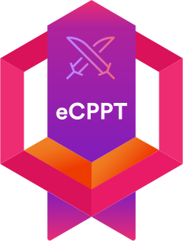
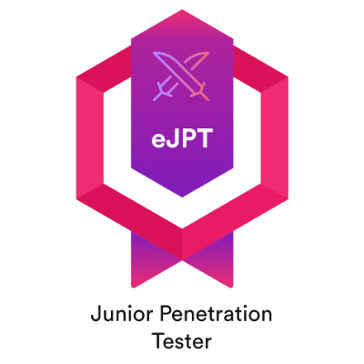

<div align="center">

# 👋 Hello There!

</div>

> **⚠️ WARNING:** This repository contains high levels of caffeine, shell scripts, and unsolicited opinions about why `vim > emacs`.

```bash
$ whoami
> NONAN23x — Code breaker by day, CTF player by night

$ echo $SKILLS
> Breaking things intentionally (to fix them better)
> Writing code that occasionally works on first try
> Turning coffee into exploits and blog posts

$ curl https://nonan23x.dev
> Tech writeups, security research, and gaming rants

$ ps aux | grep hobbies
> Lies of P (souls-like masochist)
> Minecraft (professional block architect)
> Hunting flags in CTFs
```

**Mission:** Crafting secure systems while documenting the chaos at **[nonan23x.dev](https://nonan23x.dev/)**

<br/>

<div align="center">

# 🥇 My Certifications

<p>

  
  
  
</p>
</div>

---

## 📊 SYSTEM ANALYTICS

<div align="center">
  
  <!-- Stats Grid -->
  
  
  
  <br><br>
  
  <!-- Language Stats -->
  
  
  <br><br>
  
  <!-- Contribution Graph -->
  
  
</div>

---

## 🔧 ACTIVE PROJECTS

```diff
+ [████████████████░░░░] PKI-CLM-Lab        - Public Key Infrastructure & Certificate Lifecycle
+ [██████████████░░░░░░] Marionette         - OSCP-Like Vulnerable Boot2Root CTF Challenge  
+ [█████████████░░░░░░░] Rootkit-Analysis   - Linux Kernel Rootkit Case Study
! [████████░░░░░░░░░░░░] Secret Project     - [CLASSIFIED] - Red Team Toolkit
? [░░░░░░░░░░░░░░░░░░░░] OSCP Prep          - Offensive Security Certification Journey
```

<div align="center">

| Project | Description | Tech Stack | Status |
|:-------:|:-----------:|:----------:|:------:|
| 🔐 **PKI-CLM-Lab** | Enterprise PKI with automated certificate lifecycle | `Python` `OpenSSL` `Ansible` `Docker` |  |
| 🎭 **Marionette** | Vulnerable VM for OSCP practice | `Bash` `C` `Python` `Docker` |  |
| 🐛 **Rootkit-Analysis** | Linux kernel rootkit research | `C` `Assembly` `GDB` `Volatility` |  |

</div>

---

## ⚔️ ARSENAL

<div align="center">

  <!-- Programming Languages -->
  <h4>💻 Languages</h4>
  
  
  <!-- Security Tools -->
  <h4>🔒 Security & Forensics</h4>
  
  
  
  
  
  
  
  <!-- DevOps & Infra -->
  <h4>☁️ Infrastructure & DevOps</h4>
  
  
  <!-- Databases -->
  <h4>🗄️ Databases</h4>
  
  
  <!-- IDEs & Tools -->
  <h4>🛠️ Development Environment</h4>
  
  
  
</div>

---

## 🎮 WHEN AFK

<div align="center">
  
  
  
  
  
  
  <br><br>
  
  <!-- Steam/Game Status (Template - needs Steam API) -->
  
  
  
</div>

---

## 📝 LATEST FROM THE LAB

<div align="center">
  
  [](https://nonan23x.dev/)
  
  <br>
  
  <!-- Blog Posts (This can be automated with GitHub Actions) -->
  
  ```diff
  [2024-01-XX] + New Writeup: Marionette CTF Walkthrough
  [2024-01-XX] + Tutorial: Setting up a Home PKI Lab
  [2024-01-XX] + Analysis: Modern Linux Rootkit Techniques
  [2024-01-XX] + CTF: HackTheBox - Machine Name [Pwned]
  ```
  
</div>

---

## 🔗 ESTABLISH CONNECTION

<div align="center">
  
  [](https://www.linkedin.com/in/nonan23x/)
  [](https://www.instagram.com/nonan23x)
  [](https://github.com/NONAN23x)
  [](https://www.youtube.com/channel/UCDYLeaoFXWeetM98KkuOrtA)
  [](https://nonan23x.dev/)
  [](https://tryhackme.com/p/YOUR_USERNAME)
  [](https://app.hackthebox.com/profile/YOUR_ID)
  
</div>

---

## 🐍 CONTRIBUTION SNAKE

<div align="center">
  
  
  
</div>

---

<!-- Footer -->
<div align="center">
  
  
  
</div>

<!-- Easter Egg -->
<!-- 
  ██████████████████████████████████████████
  █─▄▄▄▄█─▄▄▄─█▄─██─▄█▄─▄▄─█─▄▄─█▄─▀█▀─▄█
  █▄▄▄▄─█─███▀██─██─███─▄█▀█─██─██─█▄█─██
  ▀▄▄▄▄▄▀▄▄▄▄▄▀▀▄▄▄▄▀▀▄▄▄▄▄▀▄▄▄▄▀▄▄▄▀▄▄▄▀
  
  If you're reading this, you're curious enough to be a hacker.
  Keep digging. The rabbit hole goes deeper.
  
  Contact: Your email or signal
  PGP Key: Your PGP fingerprint
-->
