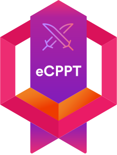
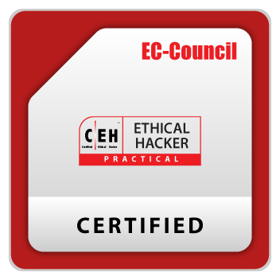
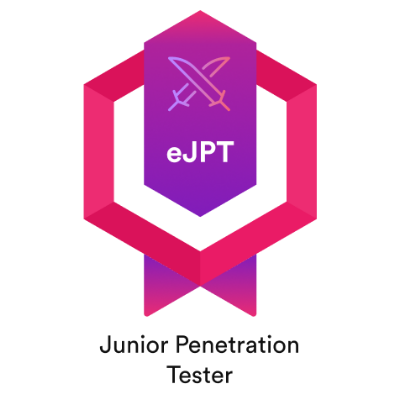
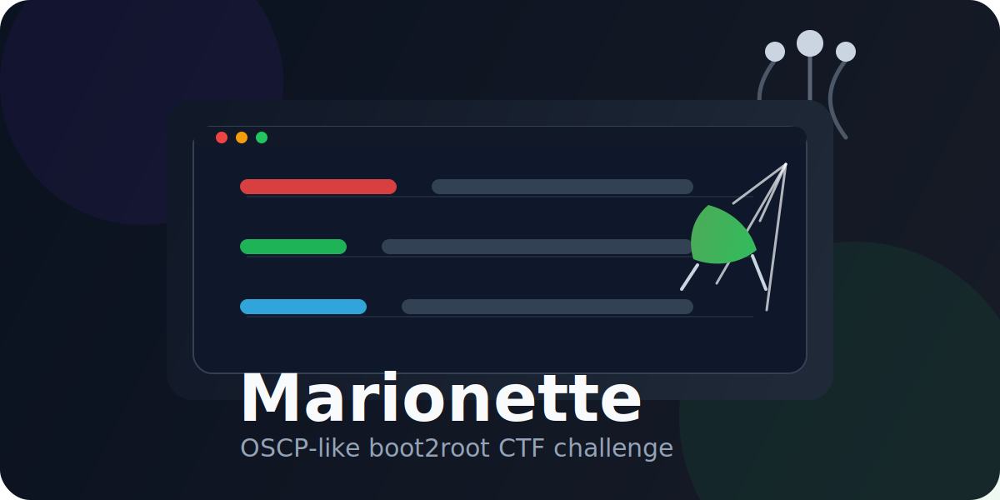

# NONAN23x

**Developer @Razz Security**  
Backend infrastructure, code review, training content, and offensive security research.

I work at the point where engineering discipline and offensive security overlap. At **Razz Security**, I build backend infrastructure, review code with a security-first lens, and develop training content grounded in real attack paths. Outside work, I spend most of my time on CTFs, lab design, adversarial research, and systems work that sharpens both operator instinct and engineering judgment.

## Focus

- Offensive security centered on high-signal recon, attack surface mapping, exploitation, and privilege escalation
- Network and Active Directory assessments with a bias toward realistic operator tradecraft
- Backend infrastructure, code review, and secure engineering workflows that hold up under scrutiny
- Training content that translates offensive technique into repeatable, teachable practice
- Sound system development and low-level tinkering that complement my security and engineering work

## Security Impact

- Turn broad or messy scope into a usable map of assets, trust relationships, and attack paths
- Move from enumeration to exploitation by prioritizing findings that create leverage, not noise
- Identify privilege escalation opportunities across Linux, Windows, and AD-centric environments with a focus on what is actually exploitable
- Build labs, workflows, and internal tooling that make offensive techniques reproducible, explainable, and useful beyond a one-off engagement

## Certifications

<table align="center">
  <tr>
    <td width="25%" align="center" valign="middle">
      
    </td>
    <td width="25%" align="center" valign="middle">
      
    </td>
    <td width="25%" align="center" valign="middle">
      
    </td>
    <td width="25%" align="center" valign="middle">
      
    </td>
  </tr>
  <tr>
    <td align="center"><strong>eCPPT</strong></td>
    <td align="center"><strong>CEH</strong></td>
    <td align="center"><strong>CEH Practical</strong></td>
    <td align="center"><strong>eJPT</strong></td>
  </tr>
</table>

## Platforms

 
 

 
 

## Selected Work

<table>
  <tr>
    <td width="50%" valign="top">
      
      <h3><a href="https://github.com/NONAN23x/PKI-CLM-Lab">PKI-CLM-Lab</a></h3>
      
A Public Key Infrastructure and Certificate Lifecycle Management Home Lab walkthrough, featuring EJBCA by Keyfactor

    </td>
    <td width="50%" valign="top">
      
      <h3><a href="https://github.com/NONAN23x/Marionette">Marionette</a></h3>
      
An OSCP-like boot2root CTF challenge

    </td>
  </tr>
  <tr>
    <td width="50%" valign="top">
      
      <h3><a href="https://github.com/NONAN23x/Rootkit-Analysis-Lab">Rootkit-Analysis-Lab</a></h3>
      
Linux rootkit analysis and low-level research lab focused on stealth, persistence, and forensic visibility

    </td>
    <td width="50%" valign="top">
      
      <h3><a href="https://github.com/NONAN23x/SoC-Home-Lab">SoC-Home-Lab</a></h3>
      
Yet another SoC lab

    </td>
  </tr>
</table>

## Stack

  

## Connect

